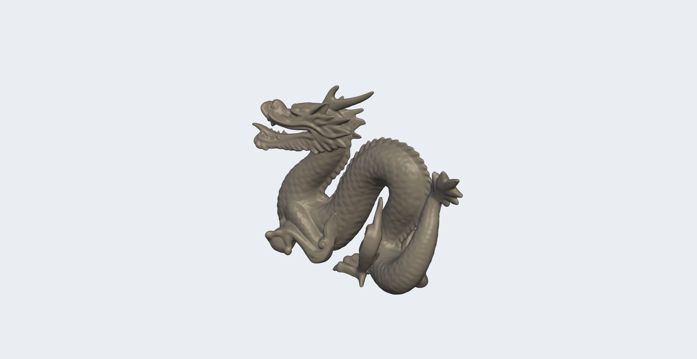
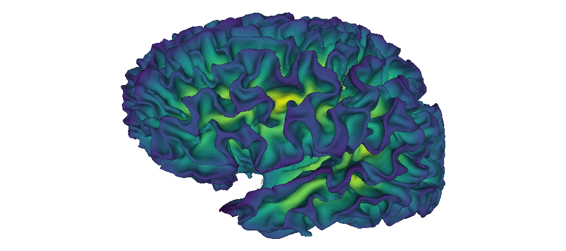

# scimesh

scimesh is a fast 3D mesh renderer that produces publication-quality images entirely on the CPU.

We provide both a C++ library and an R package.  No OpenGL, no X11, no GPU drivers required.  Works anywhere a C++17 compiler **or** R runs: HPC clusters, headless servers, macOS without XQuartz, containers, and CI pipelines.

<!-- badges: start -->
  [](https://doi.org/10.5281/zenodo.21374840)
  [](https://github.com/dfsp-spirit/scimesh/actions/workflows/R-CMD-check.yaml)
  [](https://github.com/dfsp-spirit/scimesh/actions)
  [](https://github.com/dfsp-spirit/scimesh/actions)
<!-- badges: end -->

## Visualization Examples



*The [Stanford Dragon](https://graphics.stanford.edu/data/3Dscanrep/) (871k triangles), rendered with scimesh's
software rasterizer using smooth shading, three-point Blinn-Phong
lighting, and 4x anti-aliasing. Render time 5.2 seconds on the author's mini PC (AMD Ryzen 7 8745H CPU). Source code:
[R](examples/R/dragon/run.R) | [C++](examples/cpp/dragon/main.cpp)*




*A FreeSurfer reconstruction of a human brain surface based on an MRI scan (300k triangles), rendered with scimesh's
software rasterizer using smooth shading, no anti-aliasing. Render time 1.8 seconds on the author's mini PC. Source code:
[R](examples/R/whole_brain_sulc/run.R) | [C++](examples/cpp/whole_brain_sulc/main.cpp)*

## What scimesh is

- A **headless software renderer** — renders 3D triangle meshes to
  images without any GPU or display server. This means you could use scimesh for non-interactive rendering
  when rgl/OpenGL is unavailable.
- Designed for **scientific mesh visualization** (neuroimaging, molecular structures, geometric primitives).
- **Beautiful** enough for publication figures, and still **fast** enough for batch processing on headless servers: all rendering is done in optimized C++, optionally with OpenMP parallelization.

## Features

### C++ layer

- Software rasterization with z-buffer, smooth and flat shading
- Multi-light Blinn-Phong illumination with specular highlights
- Anti-aliasing via ordered-grid supersampling (2x, 4x SSAA)
- Semi-transparent mesh overlays with depth-sorted alpha blending
- Wireframe rendering with adaptive edge thickness
- Orthographic and perspective projection
- Screen-space ambient occlusion (SSAO)
- Depth cueing (fog)
- Clip planes
- Procedural geometry: spheres, cylinders, cuboids, pyramids, tetrahedra, tori, planes
- Mesh I/O: STL (binary/ASCII), Wavefront OBJ, Stanford PLY
- Image I/O: PNG, PPM, BMP
- Automatic camera framing (`camera_fit_mesh`, `camera_fit_scene`)
- Per-vertex and per-face coloring (vertex colors, face colors)
- Texture mapping with bilinear sampling
- Mesh transform utilities: translate, scale, rotate, arbitrary 4x4 matrices

### R Layer

The R layer gives access to all C++ layer features, and adds on top:

- Easy, high-level access from R
- Image composition: grids, cropping, stacking
- Colorbars (and using them during image composition)


## What scimesh is not

- Not a plotting framework — use ggplot2, lattice, or plotly for
  statistical plots.  scimesh renders 3D geometry.
- Not a hardware renderer — no OpenGL, Vulkan, or Metal.  For
  interactive 3D rotation, use rgl. In general, real-time rendering requires hardware support (a graphics card and the full associated software stack).
- Not a system for physical based rendering — no PBR materials, no raytracing, etc.
- Not a mesh editing/manipulation framework — it reads, transforms,
  and renders meshes but does not provide interactive editing, mesh
  repair, remeshing, or boolean operations.
  For mesh repair and remeshing in R, see the
  [Rvcg](https://cran.r-project.org/package=Rvcg) package (wraps VCGLib).


## Installation

### R package

```r
# Install from GitHub
remotes::install_github("dfsp-spirit/scimesh")

# For FreeSurfer neuroimaging data
remotes::install_github("dfsp-spirit/freesurferformats")
```

### C++ (header + source)

The C++ core lives in `src/core/`.  To use scimesh in a C++ project,
add the source files and include paths to your build system.  See
[`docs/CPP_GETTING_STARTED.md`](docs/CPP_GETTING_STARTED.md) for
details.

## Quick Start

### R

```r
library(scimesh)

sphere <- generate_sphere(c(0, 0, 0), radius = 1.2,
                          segments = 32, color = c(0.9, 0.3, 0.2, 1.0))
cam <- camera_auto(sphere, direction = c(1.2, 0.8, 1))

# Flat-shaded sphere
img_shaded <- render_mesh(sphere$vertices, sphere$triangles,
    colors = sphere$colors, camera = cam,
    options = render_options(
        lights = list(
            list(position = c(0.5, 1.0, 0.8), intensity = 1.5),
            list(position = c(-0.5, 0.2, 0.6), intensity = 0.5))))

# Wireframe sphere
img_wire <- render_mesh(sphere$vertices, sphere$triangles,
    colors = sphere$colors, camera = cam,
    options = render_options(wireframe = TRUE,
        wireframe_color = c(0, 0, 0, 1),
        backface_culling = FALSE))

# Side-by-side
img <- stack_horizontal(img_shaded, img_wire)
write_png(img, "sphere.png")
```

## Documentation

- **R vignette**: `vignettes/scimesh.Rmd` — comprehensive guide to the
  R package with examples for all major features.
- **C++ getting started**: [`docs/CPP_GETTING_STARTED.md`](docs/CPP_GETTING_STARTED.md)
  — gentle introduction to the C++ renderer.
- **R examples**: [`examples/R/`](examples/R/) — runnable scripts
  demonstrating textured rendering, transparency, and neuroimaging
  visualization.
- **C++ examples**: [`examples/cpp/`](examples/cpp/) — standalone
  programs covering textured OBJ, transparency, protein visualization,
  and whole-brain rendering.
- **R live help**: Help for a specific function can be accessed in the usual R manner: `?<function>`, where you replace `<function>` with a function name. Like this: `?read_ply`.
* **R live demos**: Run `example(<function>)` to see a live demo that uses the function `<function>`. Like this: `example(read_ply)`.
* **Tests:** Some of the [unit tests for cpp](./cpp_tests/) and [for R]((./tests/testthat/)) that come with this package are essentially examples that illustrate how to use the functions.


### Direct Links to Example Program Source Code

| Example | Language | Description |
|---------|----------|-------------|
| [`examples/R/spot_cow/`](examples/R/spot_cow/) | R | Textured OBJ mesh (Spot cow) with multi-light setup |
| [`examples/R/transparency/`](examples/R/transparency/) | R | Semi-transparent pial overlay on white matter |
| [`examples/R/primitives/`](examples/R/primitives/) | R | All geometric primitives demo |
| [`examples/R/dragon/`](examples/R/dragon/) | R | Stanford Dragon with SSAO, specular, and 4x AA |
| [`examples/R/whole_brain_sulc/`](examples/R/whole_brain_sulc/) | R | Whole-brain sulcal depth rendering |
| [`examples/R/video_frames_orbit/`](examples/R/video_frames_orbit/) | R | Turntable video from orbit frames |
| [`examples/cpp/spot_cow/`](examples/cpp/spot_cow/) | C++ | Textured OBJ rendering with bilinear sampling |
| [`examples/cpp/bunny/`](examples/cpp/bunny/) | C++ | High-quality Stanford Bunny with SSAO, specular, and 4x AA |
| [`examples/cpp/dragon/`](examples/cpp/dragon/) | C++ | Stanford Dragon with SSAO, specular, and 4x AA |
| [`examples/cpp/all_primitives/`](examples/cpp/all_primitives/) | C++ | All geometric primitives demo |
| [`examples/cpp/transparency/`](examples/cpp/transparency/) | C++ | Multi-mesh alpha blending with FreeSurfer data |
| [`examples/cpp/protein_data_bank_pdb_file/`](examples/cpp/protein_data_bank_pdb_file/) | C++ | Protein ball-and-stick visualization from PDB files |
| [`examples/cpp/whole_brain_sulc/`](examples/cpp/whole_brain_sulc/) | C++ | Whole-brain sulcal depth rendering |
| [`examples/cpp/whole_brain_sulc_fsaverage/`](examples/cpp/whole_brain_sulc_fsaverage/) | C++ | Same on fsaverage template |
| [`examples/cpp/whole_brain_annot/`](examples/cpp/whole_brain_annot/) | C++ | Cortical parcellation visualization |
| [`examples/cpp/brain_video/`](examples/cpp/brain_video/) | C++ | Turntable brain animation via camera_orbit() |


## Acknowledgements

Thanks heaps to the authors of these great software packages that scimesh is built upon:

- `cpp_tests/catch_amalgamated.{h,cpp}`: [catchorg/Catch2](https://github.com/catchorg/Catch2/tree/devel/extras) — C++ test framework.
- `src/third_party/glm/`: [g-truc/glm](https://github.com/g-truc/glm) — header-only C++ math library.
- `src/third_party/tinyply.{h,cpp}`: [ddiakopoulos/tinyply](https://github.com/ddiakopoulos/tinyply) — PLY file reader.
- `src/third_party/tiny_obj_loader.h`: [tinyobjloader/tinyobjloader](https://github.com/tinyobjloader/tinyobjloader) — Wavefront OBJ loader.
- `src/third_party/libfs.h`: [dfsp-spirit/libfs](https://github.com/dfsp-spirit/libfs) — FreeSurfer file format reader.
- `src/third_party/stl_reader.h`: [sreiter/stl_reader](https://github.com/sreiter/stl_reader) — STL file reader.
- `src/third_party/stb_image.h`, `src/third_party/stb_image_write.h`: [nothings/stb](https://github.com/nothings/stb) — image loading/saving.

And of course, thanks to the authors of the dependencies of these packages, and their dependencies...

*Note: This section is to give credit only. Users do **not** need to worry about installing these dependencies, they come vendored with scimesh already.*


## Developer Information

Please refer to [README_DEVELOPMENT.md](./README_DEVELOPMENT.md).


## License and Author

License: [MIT](./LICENSE)

Author: [Tim Schäfer](https://ts.rcmd.org/)

